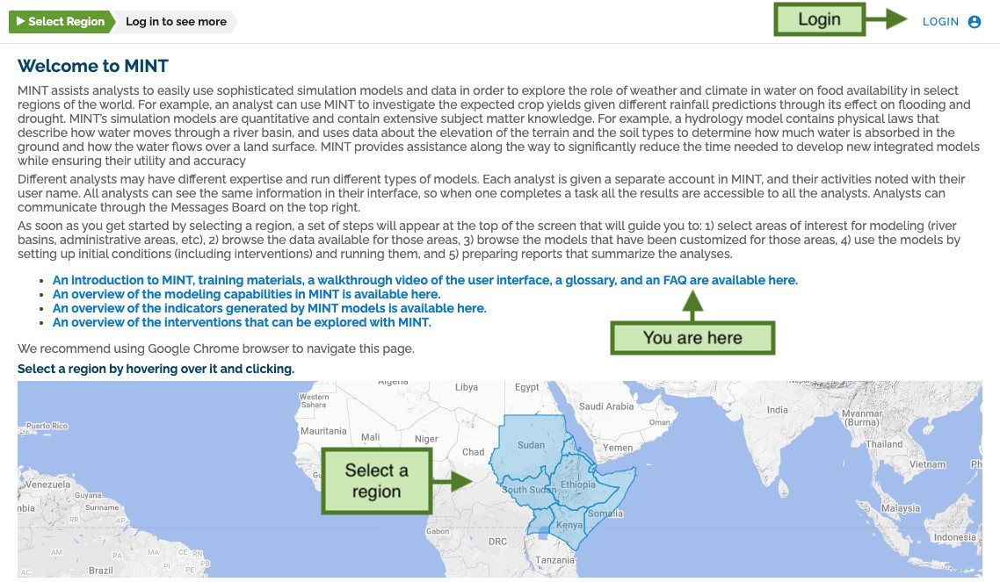
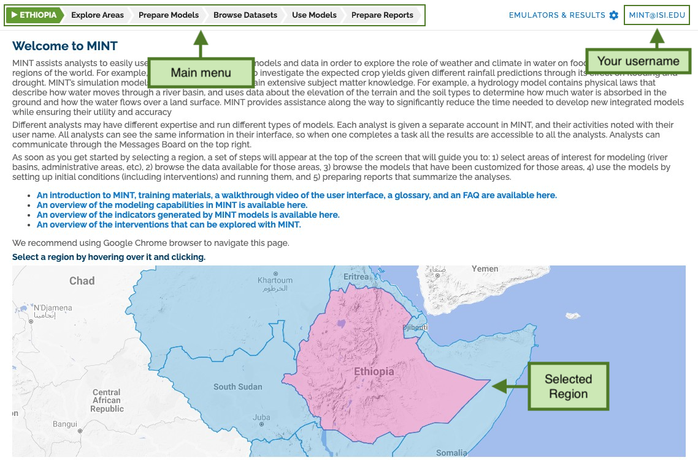

# MINT User Interface Walkthrough

## Log in and region overview

Let's start loging in and selecting a region of interest.

Once you are logged in and have selected a main region, the top menu will show you new options.

The top menu gives you access to the main sections:

- [Explore Areas](walkthrough/01-exploring-area.md)
- [Prepare Models](walkthrough/02-preparing-models.md)
- [Browse Datasets](walkthrough/03-exploring-data.md)
- [Use Models](walkthrough/04-modeling.md)
- [Prepare Reports](walkthrough/05-reporting.md)
