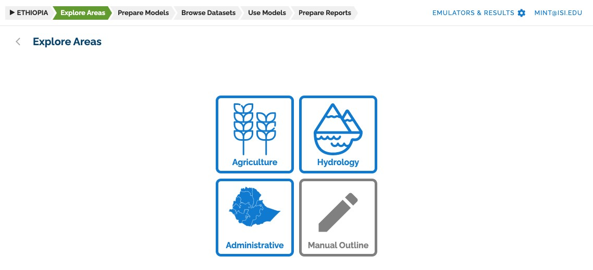
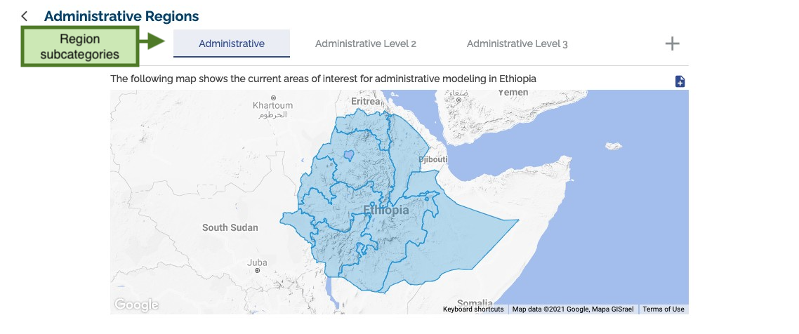
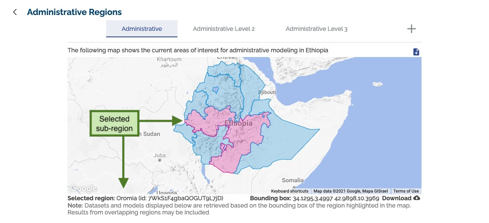
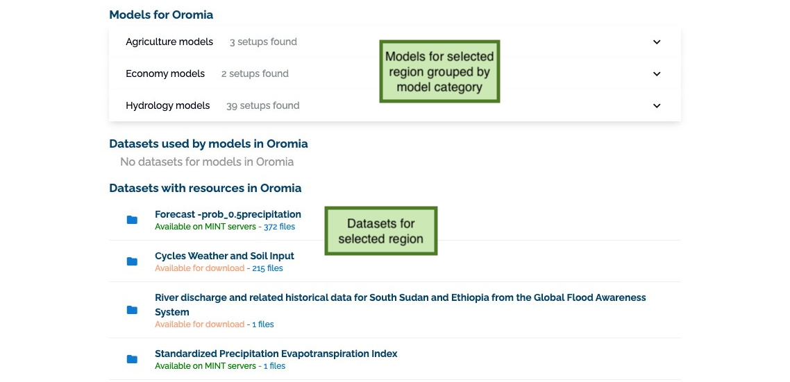

## Exploring areas

The **explore areas** section has three main categories: agriculture, hydrology and administrative areas.

Each category presents a group of subregions.

Clicking a region on the map will search the MINT catalogs for models configured for that region and datasets with data for that region.

Clicking on a model or dataset result will send you to its detailed description page.
