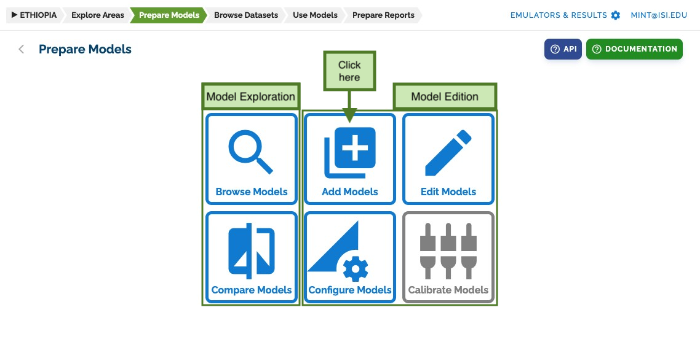
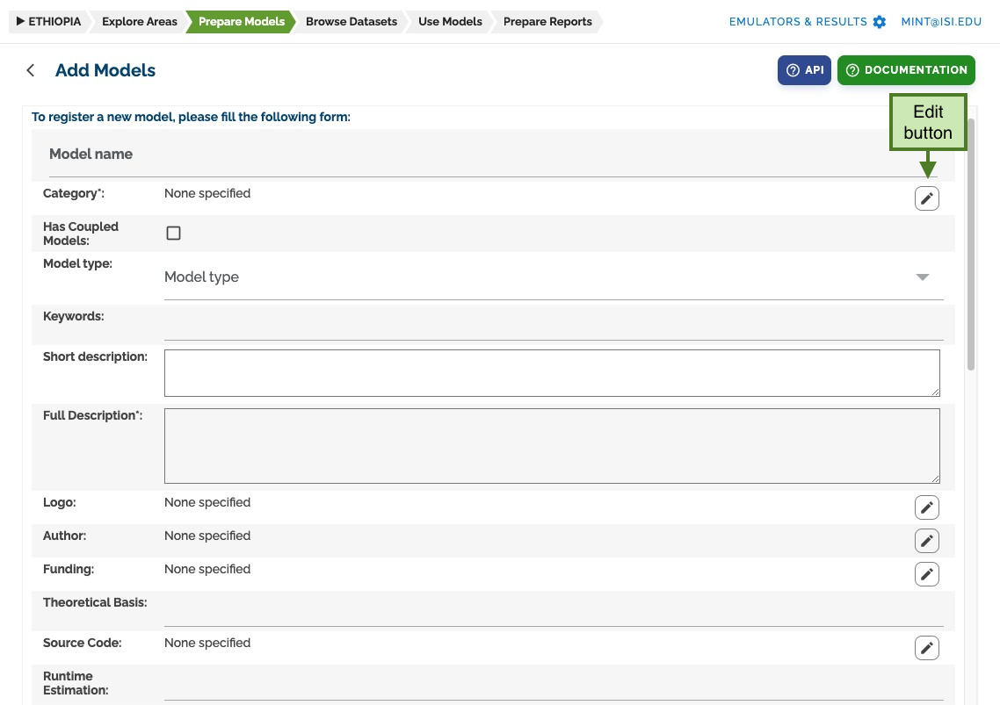
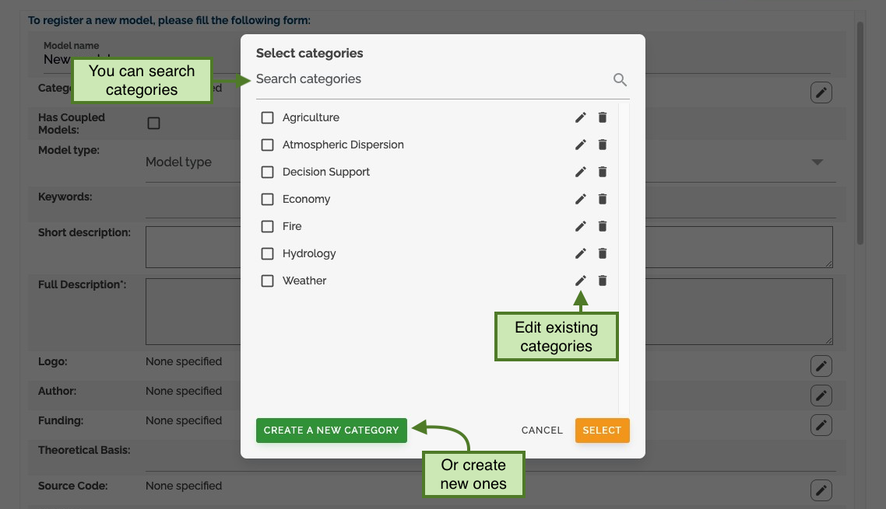
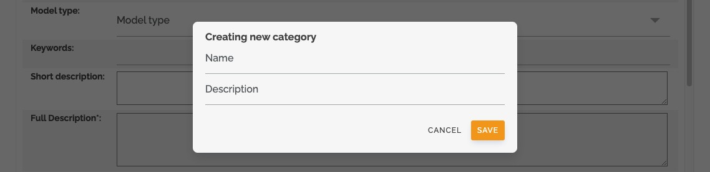
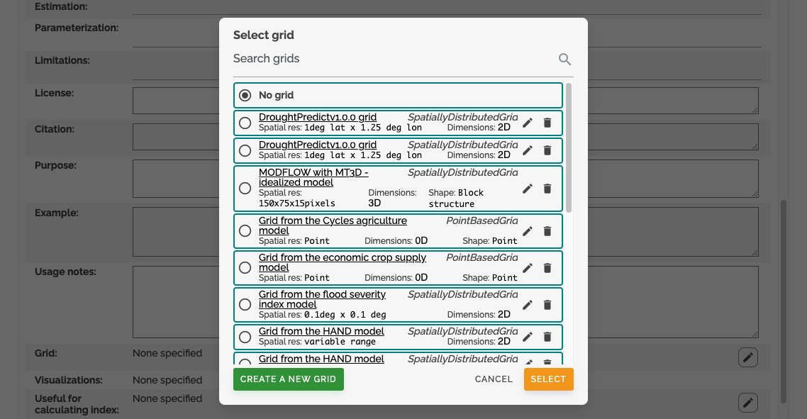
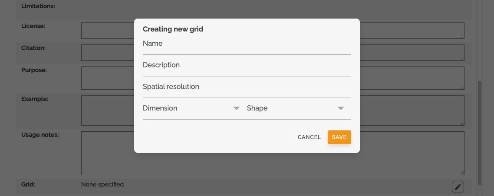

# Add Models

To add new models and versions to your catalog, go to the **prepare models** section and click on _add models_.

## Add Models Interface

The _add models_ page presents a form that can be filled out to add a new model to the catalog.
Some information should be provided as text, but more complex resources are defined through specific forms.
You will see an _edit button_ to the right of each model catalog resource.

## Resource Management

Clicking this edit button opens a new dialog. Here you can select resources already in the catalog or edit/create new ones.

When creating a new resource, a specific form with all necessary information will appear.
Fill it up to create a new resource. For this example, a new category only needs a name and description.

## Complex Resources

More complex resources have more detailed previews, but follow the same principles for creating, editing, and removing them.

Creating complex resources requires more information. This is the form to add a new grid specification to the model catalog.

