# Browse Models

Let's start exploring the model catalog by clicking on _Browse Models_

## Model Browser

The _model browser_ shows a preview of all models in the catalog and allows you to search for them by indicator, variable, region, and more.

The model preview shows the model icon and basic model information. Clicking on _More details_ will display the model's full information.
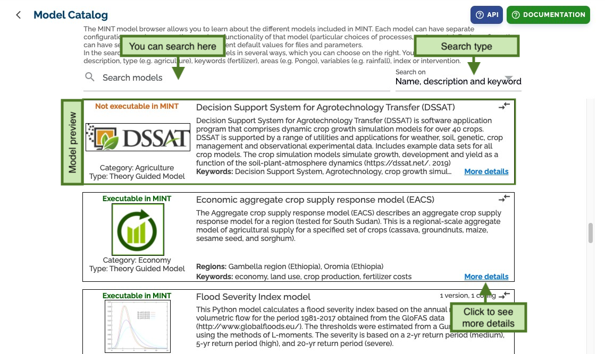

## Model Details

This page shows all the information related to the model.
As default, it shows the latest model configuration, but you can change to a specific configuration and setup with the top selectors.

After that, we can see basic model metadata and below several tabs with more details.
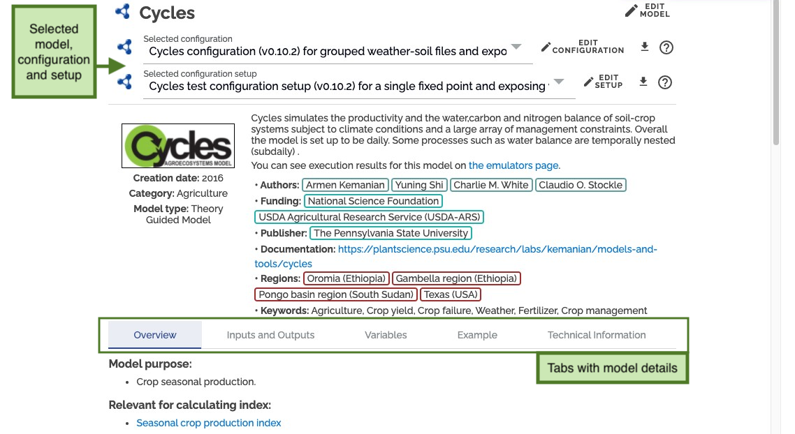

### Overview Tab

The _overview tab_ shows the model purpose, assumptions, and other non-configuration specific data.
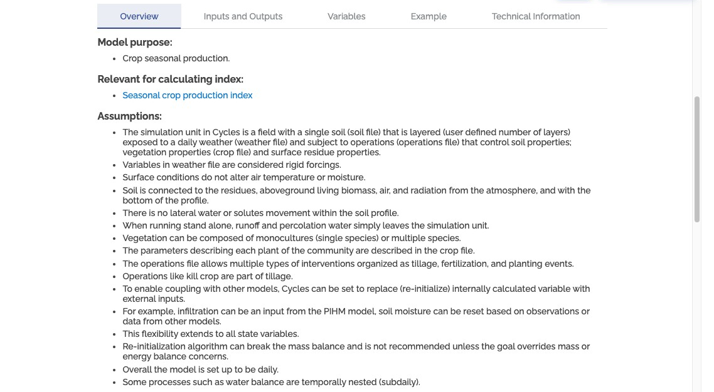

And a preview of the selected configuration and setup. Relevant information is presented for each case.
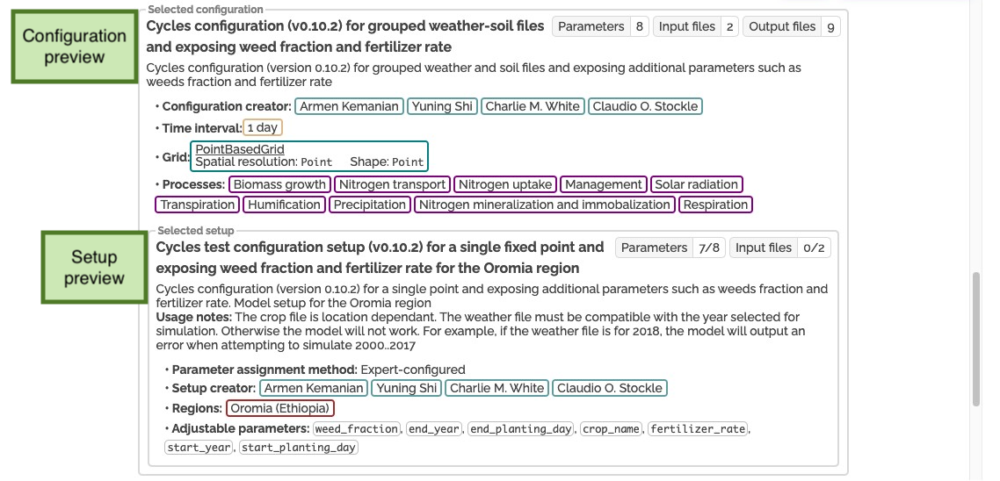

### Inputs and Outputs Tab

The _Inputs and Outputs tab_ shows all the inputs and parameters necessary to run this configuration, and the outputs that this model generates.
If a setup is selected, this tab also shows the values pre-selected for that configuration setup.
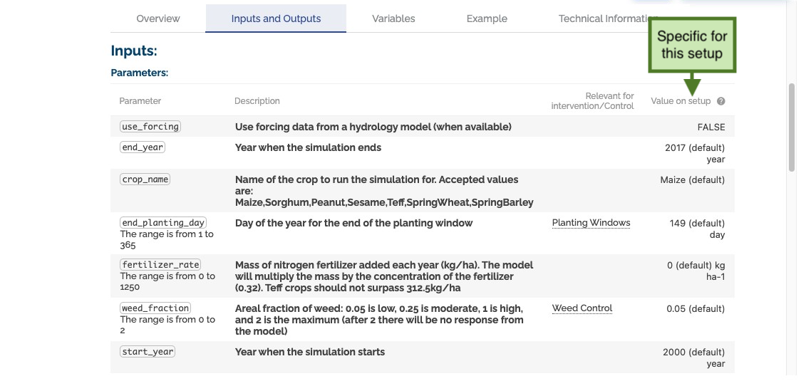
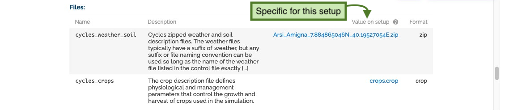
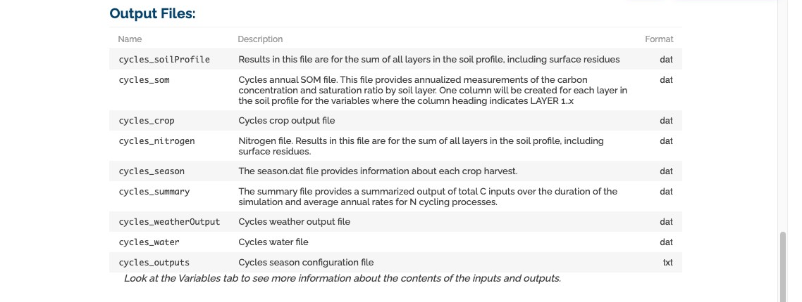

### Variables Tab

The _Variables tab_ shows all the variables that each file specification requires for this model configuration.
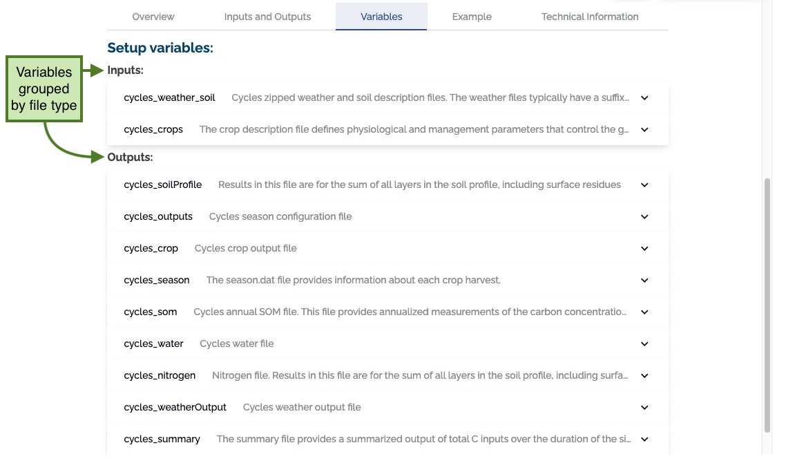

Clicking on the input file name shows a table with all the variables for that file.
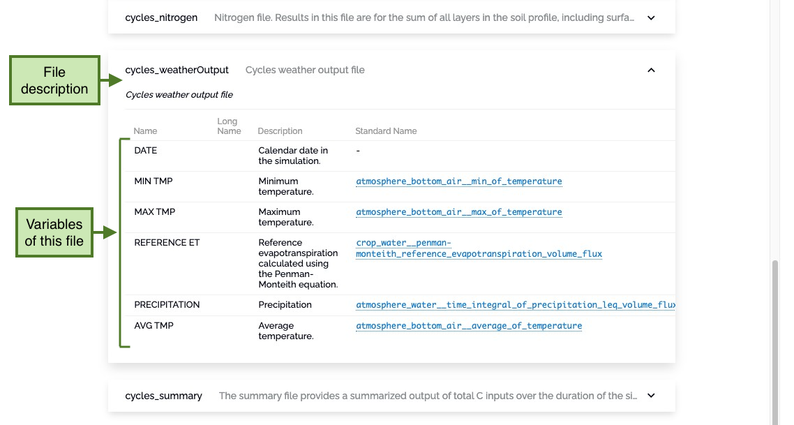

### Example Tab

The _Example tab_ shows an example written for this model configuration.
Examples are written in `markdown` and support the addition of images.
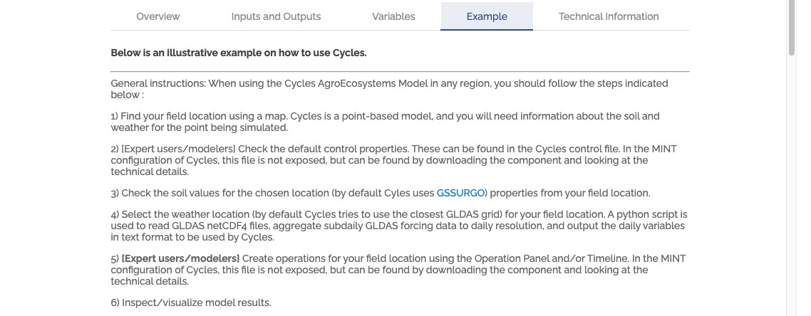
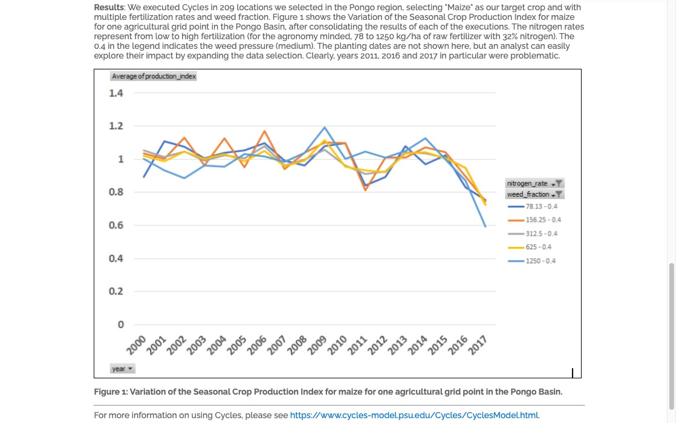

### Technical Information Tab

The _Technical information tab_ collects all the information needed to run this model, configuration and setup.
This includes the direct command to run this model using DAME.
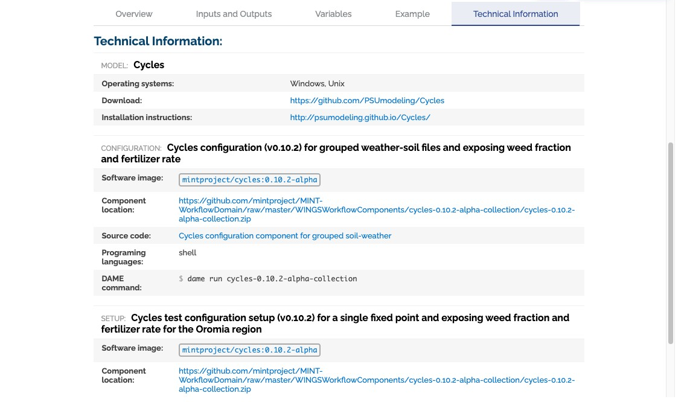
