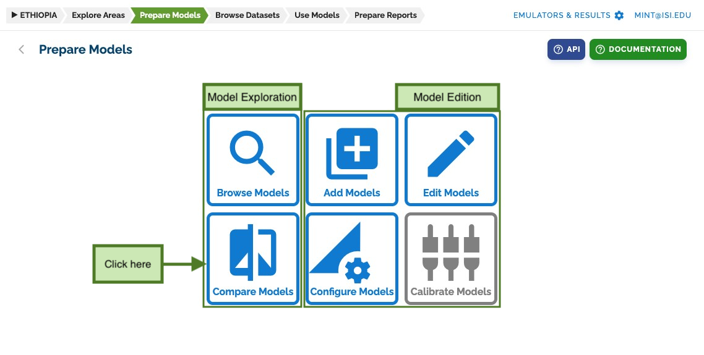
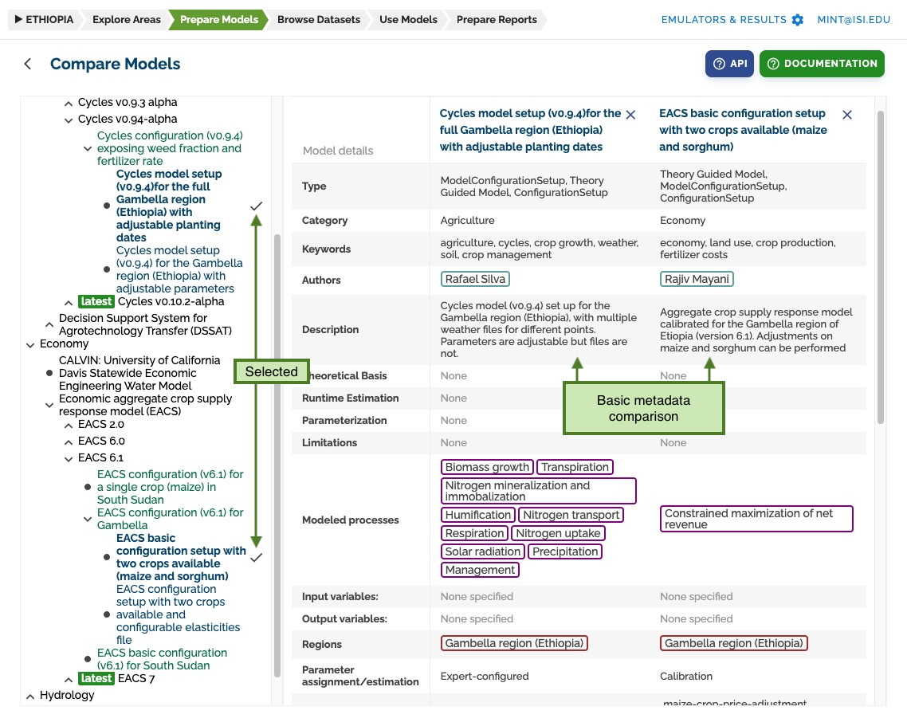
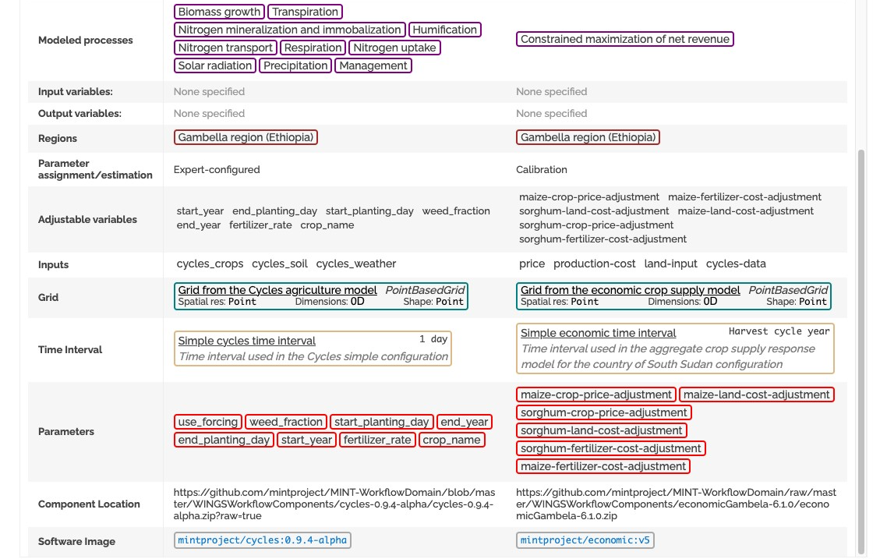

# Compare Models

To compare models, go to the **prepare models** section and click on _compare models_.

## Model Comparison Interface

A list of all models, versions, configurations, and setups of the MINT model catalog will be shown on the left.
Clicking on their names will add them to the comparison table.

## Setup Comparison

You can compare setup specific data too:

