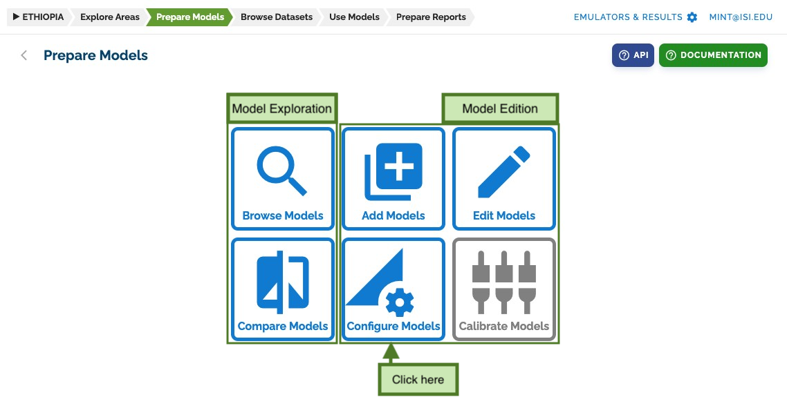
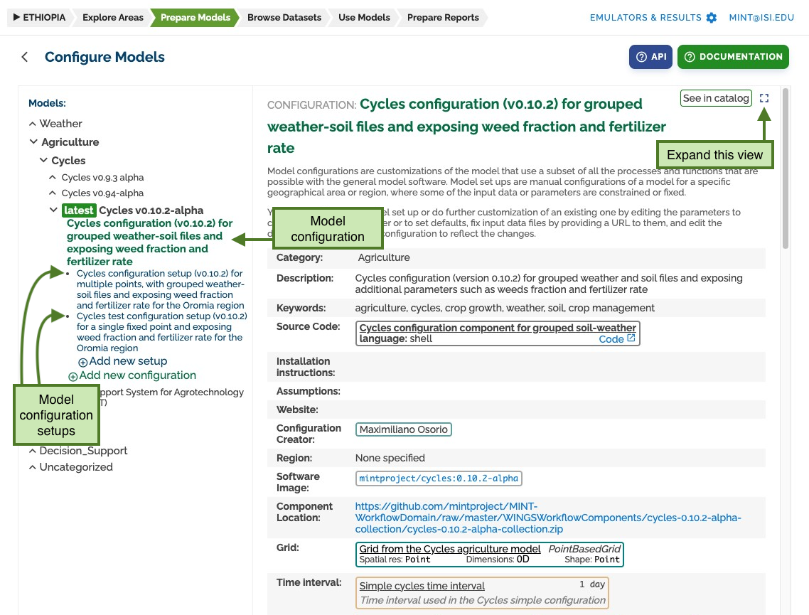
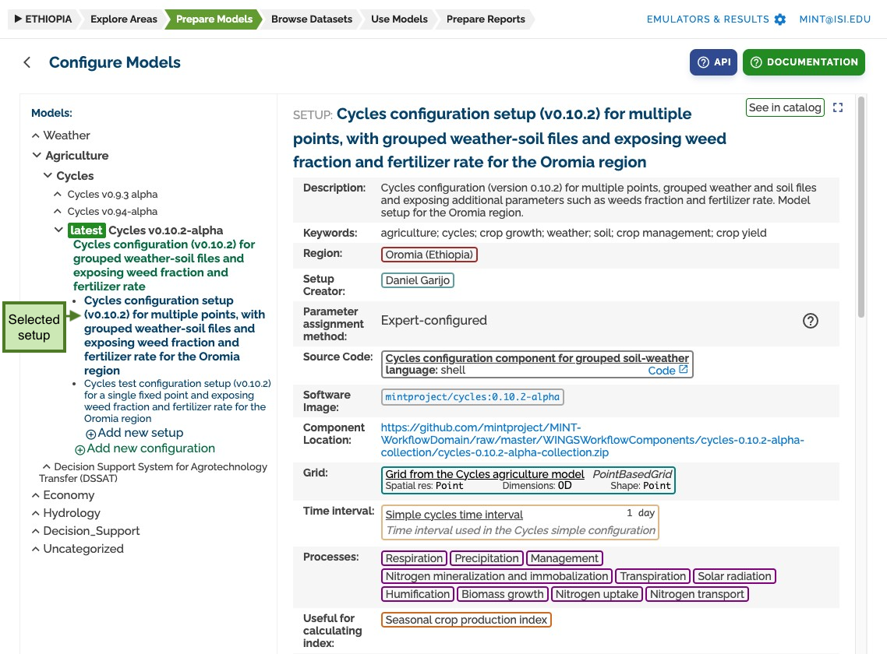
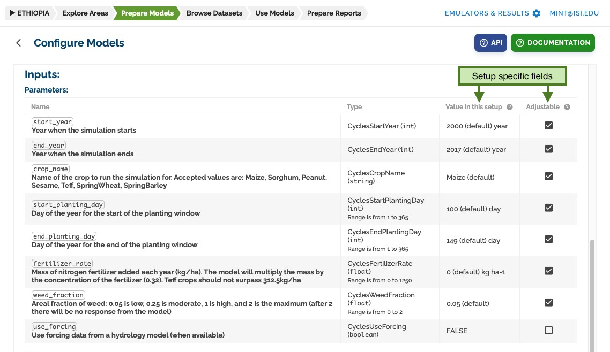
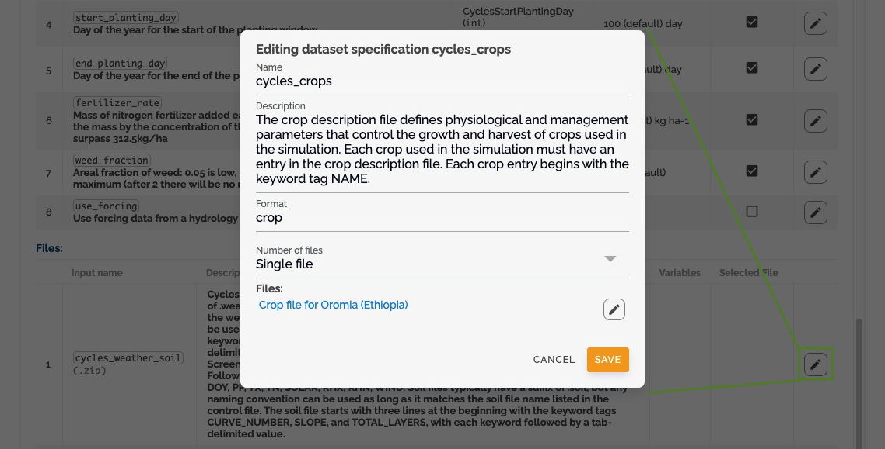

# Configure Models

The configuration system in MINT allows you to define how models should run with specific parameters and file requirements. This section explains how to set up and manage model configurations and their setups.

## Accessing Configuration Interface

To add new model configurations and setups, go to the **prepare models** section and click on _configure models_:

## Understanding the Configuration Hierarchy

The configuration system follows a hierarchical structure:

- **Models**: Top-level organization of related model versions
- **Versions**: Group configurations that share the same software revision
- **Configurations**: Define specific software parameters and file requirements
- **Setups**: Provide specific values for configurations

The _configure models_ page presents a tree view showing this hierarchy:

- Models (default color)
- Versions (grouped under models)
- Configurations (green) below versions
- Setups (blue) below configurations
  

## Working with Configurations

### What is a Configuration?

A configuration defines:

- The specific software version to run
- Required input parameters
- Input and output file specifications
- Variable requirements for each file

You can view detailed configuration information by clicking the _expand button_:

### Managing Parameters

#### Input Parameters

Each configuration defines its required parameters with:

- Description and purpose
- Parameter order
- Default values
- Data types
- Validation rules
- Other metadata
  

#### File Specifications

Configurations specify:

- Required input files
- Expected output files
- Variable requirements for each file
- File format specifications
  

### Creating and Editing Configurations

1. **Add New Configuration**

   - Click _add new configuration_ to create a new configuration
   - Or click _edit_ to modify an existing one
     

2. **Manage Parameters**

   - Add, edit, or remove parameters
   - Define parameter metadata
   - Set validation rules
     

3. **Parameter Form**

   - Use the parameter form to define:
     - Parameter names
     - Data types
     - Default values
     - Validation rules
       

4. **File Management**
   - Define input file requirements
   - Specify output file formats
   - Set variable requirements
     
     

## Working with Setups

### What is a Setup?

A setup is the most specific level of configuration, providing:

- Concrete values for parameters
- Specific input files
- Pre-configured settings for the modeling step

### Creating and Managing Setups

1. **Access Setup Interface**

   - Select or create a setup from the left panel
     

2. **Setup Configuration**
   - Set specific values for parameters
   - Select input files
   - Configure user-adjustable settings
     
     

### Parameter Configuration in Setups

In setups, you can:

- Set pre-selected values for parameters
- Mark parameters as user-adjustable
- Define parameter ranges
- Set default values
  

### File Configuration in Setups

For input files, you can:

- Select specific files
- Define file collections
- Set default selections
- Configure file validation
  

## Best Practices

1. **Configuration Organization**

   - Group related configurations under appropriate versions
   - Use clear, descriptive names
   - Document parameter purposes

2. **Parameter Management**

   - Set appropriate default values
   - Define clear validation rules
   - Document parameter dependencies

3. **Setup Creation**

   - Create setups for common use cases
   - Provide meaningful default values
   - Mark frequently adjusted parameters as user-adjustable

4. **File Management**
   - Validate file formats
   - Document required variables
   - Set appropriate file constraints
