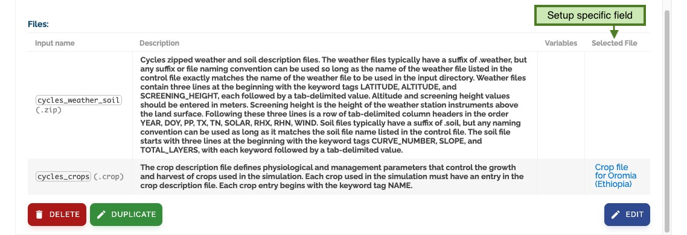

# Configure Models

To add new model configurations and setups, we need to go back to the **prepare models** section and click on
_configure models_:

## Configuration Interface

The _configure models_ page presents a tree similar to the one we have seen on _edit models_, but this time
two more levels are added: Model configurations (green) below versions and setups (blue) below configurations.

## Configurations

A configuration refers to a specific software running with a specific set of parameters and files.
You can click on the _expand button_ to better see the information this configuration provides.

### Input Parameters

For input parameters, a configuration provides their description, order, default values and other important metadata.

### File Specifications

For input and output files, a description of all the variables that this file must contain is expected.

### Managing Configurations

You can add a new configuration by clicking _add new configuration_ or edit an existing one by clicking _edit_.

You can add, edit or remove parameters for this configuration.

Clicking on the edit parameters button will display a specific form to add parameters for configurations.

The same applies to input and output files:

## Setups

We call the most inner level of a configuration a **setup**.
A setup is a configuration with specific values for parameters and files.

You can create or select an existing setup by clicking on the left panel:

This page is similar to the one used to edit configurations, but changes what you can do with parameters and files.

In a setup, you can not add nor remove parameters nor files. You can only set specific values for each.

### Parameter Configuration

For parameters, you can set a pre-selected value or mark the parameter as adjustable for the user on the **modeling** step.

### File Configuration

For input files, you can set a specific file or collections of files to be pre-selected for the **modeling** step.

