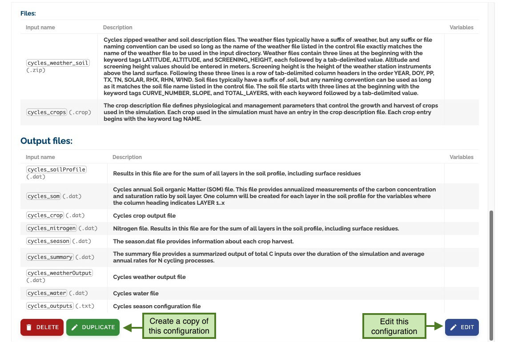

# Working with Configurations

## What is a Configuration?

A configuration defines:

- Input Files: Required data files and model components
- Input Parameters: Configuration values and settings
- Outputs: Expected results and output specifications
- ComponentLocation - The location of the model component files (required for model execution)

You can view detailed configuration information by clicking the _expand button_:

## Managing Parameters

### Input Parameters

Each configuration defines its required parameters with:

- Description and purpose
- Parameter order
- Default values
- Data types
- Validation rules
- Other metadata
  

### File Specifications

#### Input Files

Configurations specify:

- Required input files
- File format requirements
- Variable requirements for each file
- File validation rules
  

#### Output Files

Configurations define:

- Expected output files
- Output format specifications
- Output variable requirements
- Output validation rules

### Component Location

The ComponentLocation field is a critical requirement for model execution:

- Specifies the URL or path to the model component files
- Must be a valid and accessible location
- Typically points to a ZIP file containing the model code
- Required for both ModelConfiguration and ModelConfigurationSetup
- Example: `https://github.com/mintproject/MINT-WorkflowDomain/blob/main/WINGSWorkflowComponents/model-name/model-name.zip?raw=true`

For MINT versions running on TACC systems, the ComponentLocation should point to a Tapis Application. Tapis Applications are containerized applications that can be executed on TACC clusters. For more information about creating and managing Tapis Applications, refer to the [cookbook-docker-template](https://github.com/In-For-Disaster-Analytics/cookbook-docker-template) documentation.

## Next Steps

Now that you understand what configurations are, you can learn about [creating and editing configurations](creating-configurations.md). After that, you can proceed to learn about [creating and managing setups](setups.md). Setups allow you to provide specific values and pre-configured settings for your model runs based on these configurations.
