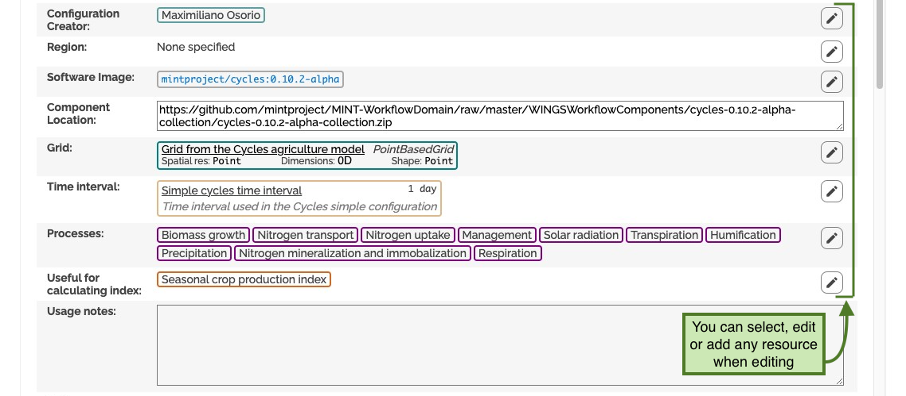
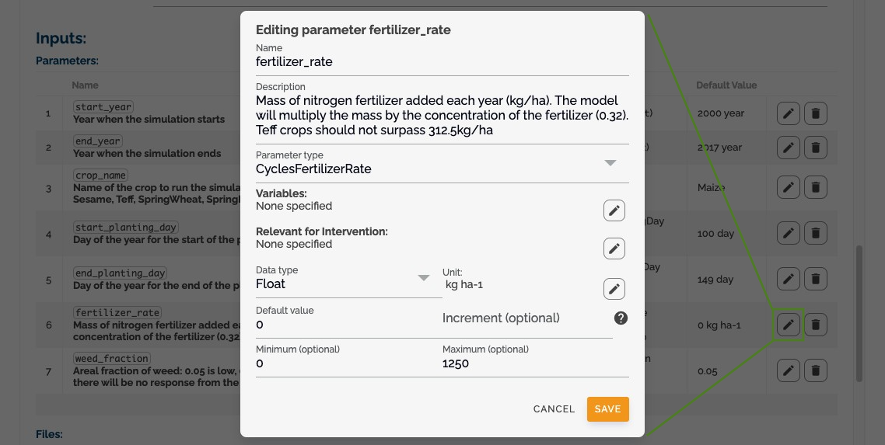

# Working with Configurations

## What is a Configuration?

A configuration defines:

- The specific software version to run
- Required input parameters
- Input and output file specifications
- Variable requirements for each file

You can view detailed configuration information by clicking the _expand button_:

## Managing Parameters

### Input Parameters

Each configuration defines its required parameters with:

- Description and purpose
- Parameter order
- Default values
- Data types
- Validation rules
- Other metadata
  

### File Specifications

Configurations specify:

- Required input files
- Expected output files
- Variable requirements for each file
- File format specifications
  

## Creating and Editing Configurations

### 1. Add New Configuration

- Click _add new configuration_ to create a new configuration
- Or click _edit_ to modify an existing one
  

### 2. Manage Parameters

- Add, edit, or remove parameters
- Define parameter metadata
- Set validation rules
  

### 3. Parameter Form

- Use the parameter form to define:
  - Parameter names
  - Data types
  - Default values
  - Validation rules
    

### 4. File Management

- Define input file requirements
- Specify output file formats
- Set variable requirements
  
  

## Configuration Types

### Basic Configuration

- Simple parameter sets
- Standard file requirements
- Common validation rules

### Advanced Configuration

- Complex parameter dependencies
- Custom validation rules
- Specialized file formats

### Custom Configuration

- User-defined parameters
- Custom file specifications
- Flexible validation rules
