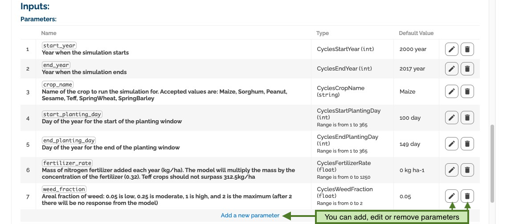
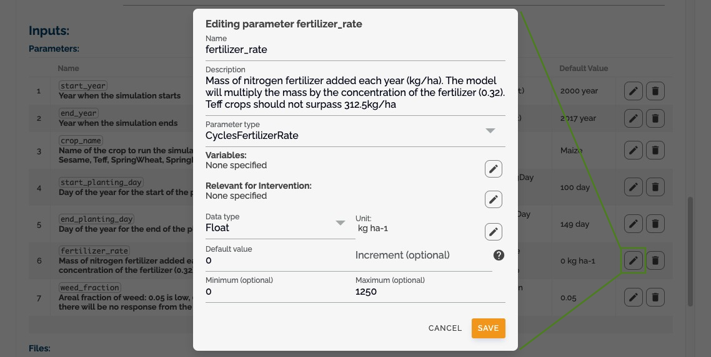
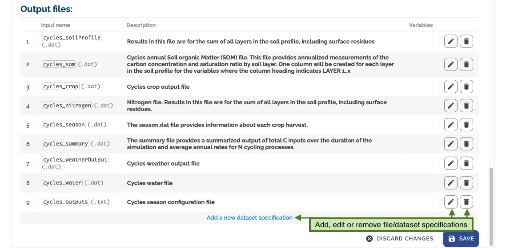
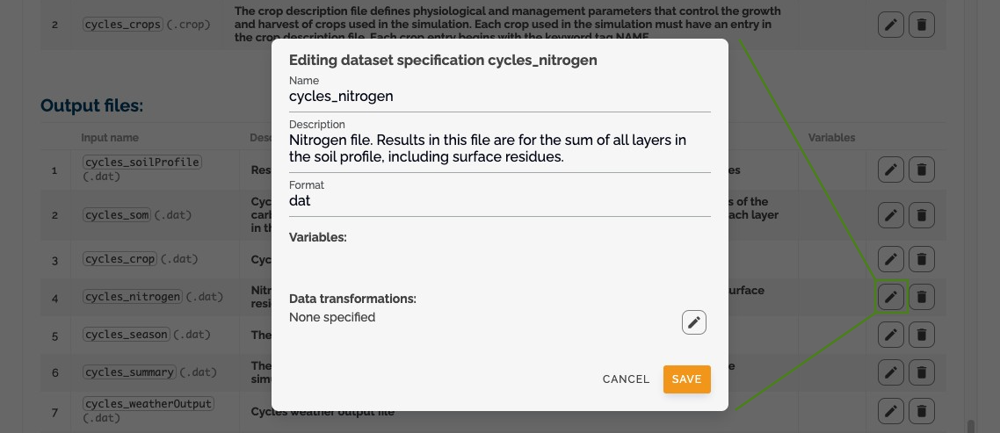

# Creating and Editing Configurations

## Add New Configuration

- Click _add new configuration_ to create a new configuration
- Or click _edit_ to modify an existing one
  

## Manage Parameters

- Add, edit, or remove parameters
- Define parameter metadata
- Set validation rules
  

## Parameter Form

- Use the parameter form to define:
  - Parameter names
  - Data types
  - Default values
  - Validation rules
    

## File Management

### Input Files

- Define input file requirements
- Set file format specifications
- Configure file validation
- Specify variable requirements
  

### Output Files

- Define output file formats
- Set output specifications
- Configure output validation
- Specify output requirements
  

!!! Note

    To make your configuration executable, you need to set up the ComponentLocation and ensure all input files have variables. See [Making your Configuration or ConfigurationSetup Executable](making-executable.md) for detailed instructions.

## Next Steps

Now that you understand how to create and edit configurations, you can proceed to learn about [creating and managing setups](setups.md). Setups allow you to provide specific values and pre-configured settings for your model runs based on these configurations.
