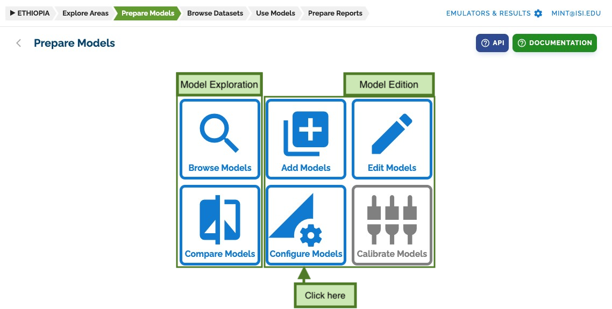

# Getting Started with Configurations

## Accessing the Configuration Interface

To add new model configurations and setups, go to the **prepare models** section and click on _configure models_:

## Configuration Interface

The _configure models_ page presents a tree view showing the configuration hierarchy:

- Models (default color)
- Versions (grouped under models)
- Configurations (green) below versions
- Setups (blue) below configurations
  

## Understanding the Tree View

The tree view provides a visual representation of your model's configuration structure:

### 1. Models Level

- Top-level organization
- Groups related model versions
- Provides model-wide settings

### 2. Versions Level

- Groups configurations by software revision
- Maintains version-specific settings
- Links to software documentation

### 3. Configurations Level

- Defines specific parameter sets
- Specifies file requirements
- Sets up validation rules

### 4. Setups Level

- Provides concrete values
- Pre-configures model runs
- Defines user-adjustable parameters

## Basic Navigation

- Click on any item in the tree to view its details
- Use the expand/collapse buttons to manage the view
- Right-click for additional options
- Use the search function to find specific items

## Next Steps

Now that you understand the basic structure of the configuration interface, you can proceed to learn about [working with configurations](configurations.md) in detail. This will show you how to define parameters, specify file requirements, and create effective model configurations.
