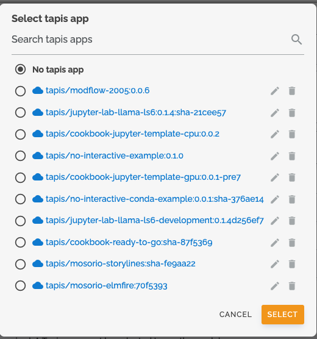
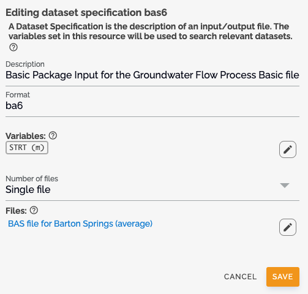
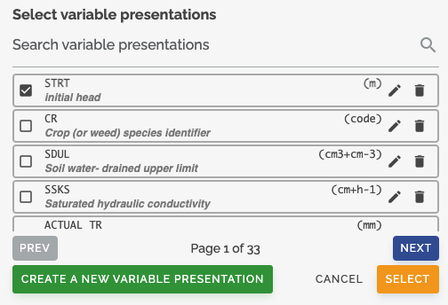

# Making your Configuration or ConfigurationSetup Executable

!!! Warning

    A ModelConfiguration or ModelConfigurationSetup is executable if:

    - Has a valid ComponentLocation
    - All input files have at least one Variable associated or are fixed files

## Setting Component Location

The ComponentLocation is a critical field that specifies where the model code is located:

### Classic MINT

1. In the configuration form, locate the "Component Location" field
2. Enter the URL to your model component files:
   - For standard MINT deployments: Use a GitHub URL pointing to a ZIP file
   - For TACC deployments: Use a Tapis Application URL

### TACC MINT

1. In the configuration form, locate the "Component Location" field
2. Click the _expand_ button to view the Component Location field
3. Select the Tapis Application from the options provided

!!! Note

    For TACC deployments, make sure your ComponentLocation points to a valid Tapis Application. Refer to the [cookbook-docker-template](https://github.com/In-For-Disaster-Analytics/cookbook-docker-template) documentation for creating Tapis Applications.

## Adding Variables to Input Files

To make your configuration executable, each input file must have at least one variable associated or be a fixed file. Follow these steps to add a variable to an input file:

1. Click the **edit** button on the input file.
   
2. In the "Variables" section, search for and select the variable(s) you want to associate with the input file.
   
3. Save your changes.

This ensures that the input file is properly specified and can be used for model execution.
