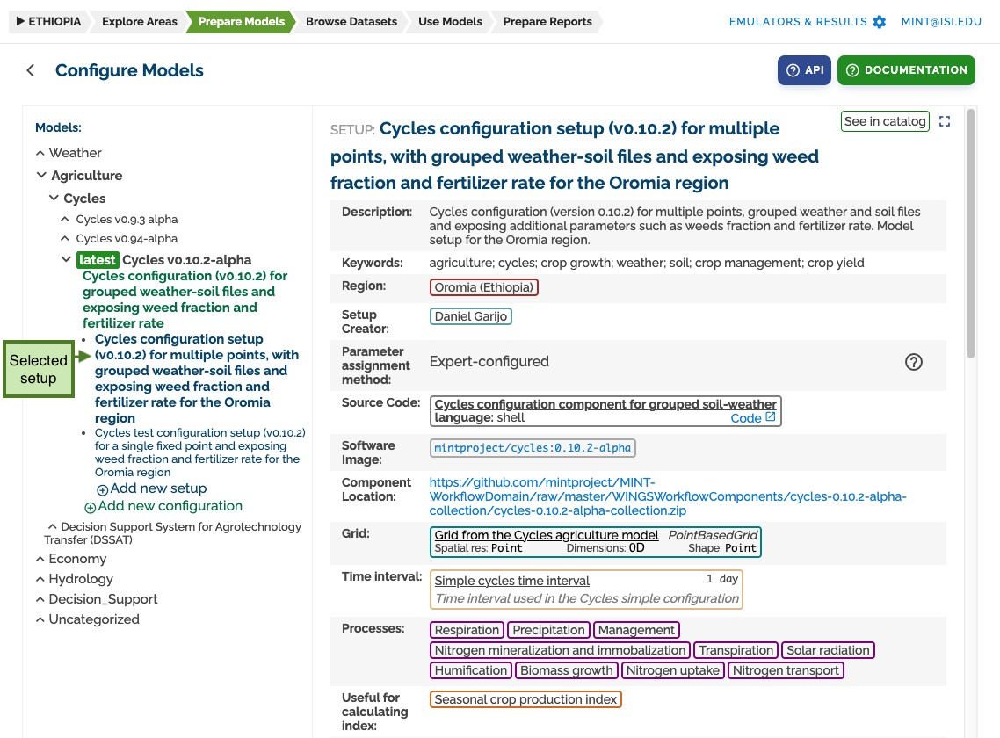
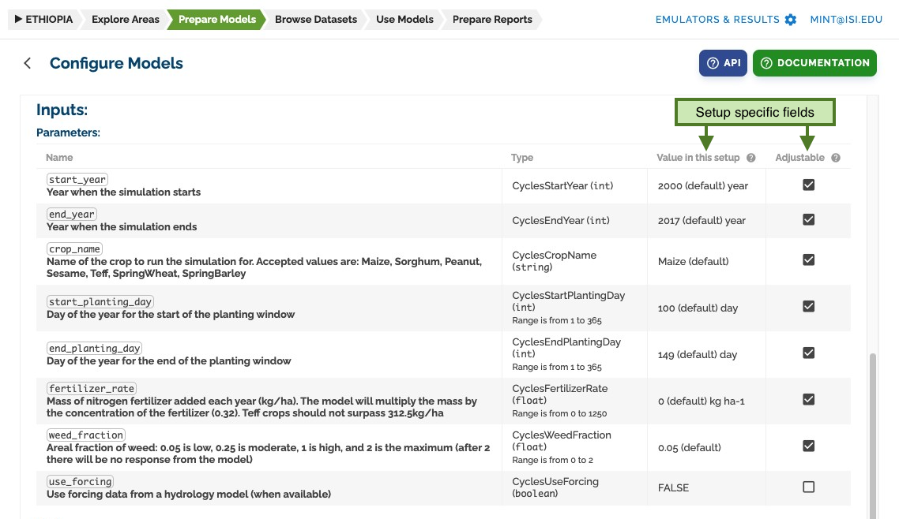
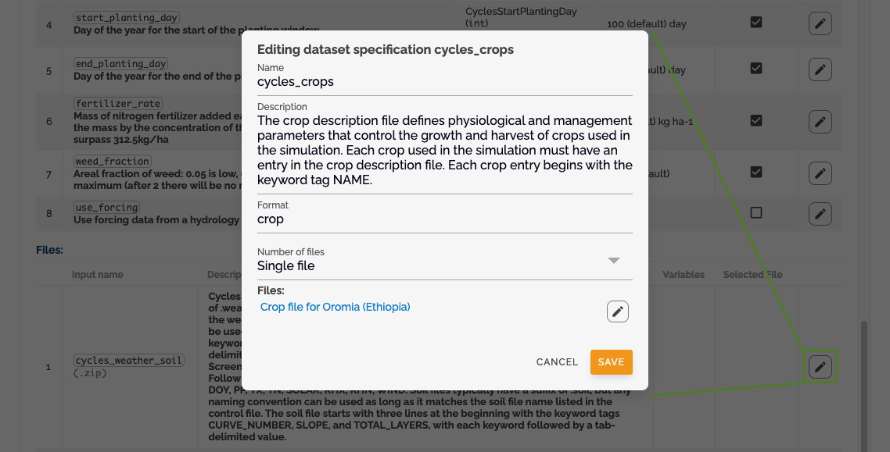

# Working with Setups

## What is a Setup?

A setup is the most specific level of configuration, providing:

- Concrete values for parameters
- Specific input files
- Pre-configured settings for the modeling step

## Creating and Managing Setups

### 1. Access Setup Interface

- Select or create a setup from the left panel
  

### 2. Setup Configuration

- Set specific values for parameters
- Select input files
- Configure user-adjustable settings
  
  

## Parameter Configuration in Setups

In setups, you can:

- Set pre-selected values for parameters
- Mark parameters as user-adjustable
- Define parameter ranges
- Set default values
  

## File Configuration in Setups

For input files, you can:

- Select specific files
- Define file collections
- Set default selections
- Configure file validation
  

## Setup Types

### Standard Setup

- Common parameter values
- Default file selections
- Basic validation rules

### Custom Setup

- User-defined values
- Specific file selections
- Custom validation rules

### Template Setup

- Reusable configurations
- Parameter templates
- File collection templates
