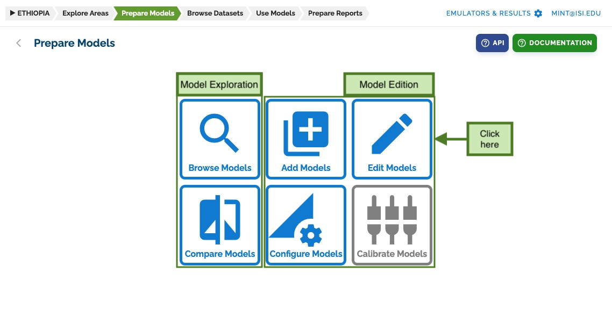
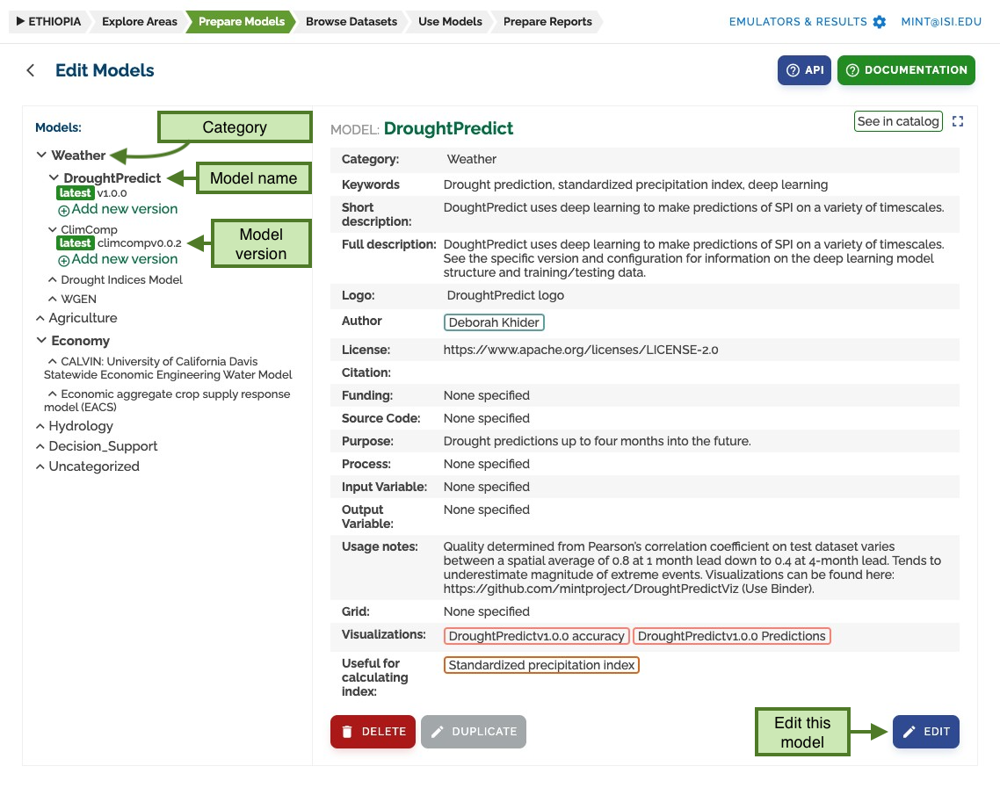
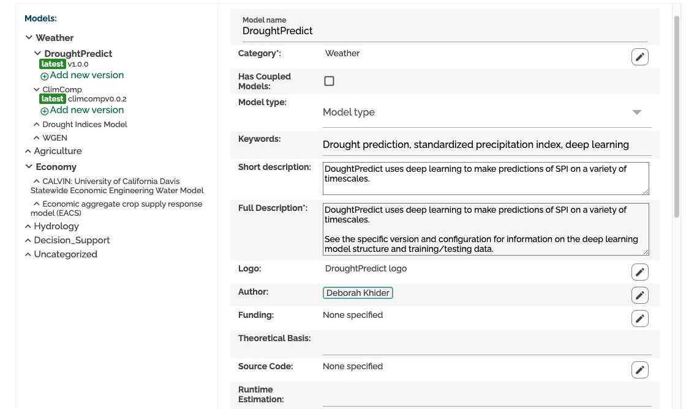

# Edit Models

Once a model has been created, you can edit it by going to the **prepare models** section and clicking on _edit models_:

## Edit Models Interface

The _edit models_ page shows a tree on the left with all models and versions defined in the model catalog.
Versions are a way to group configurations that share the same software revision.
Models are organized by category and all versions are grouped under their corresponding model.

On the right you can see a preview of the model. Clicking on the edit button will make it editable.

## Edit Mode

In edit mode, you will see an interface very similar to the _add models_ page we have seen before.

