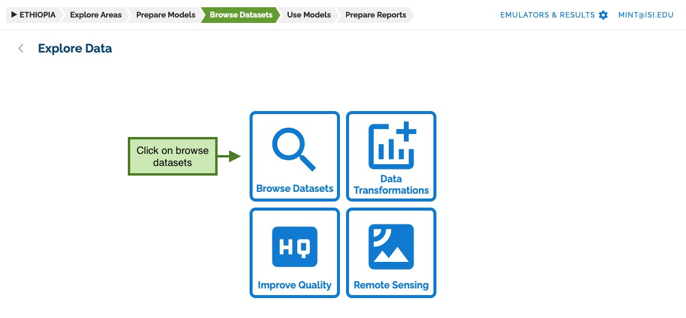
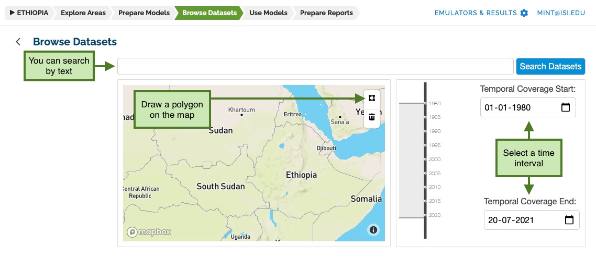
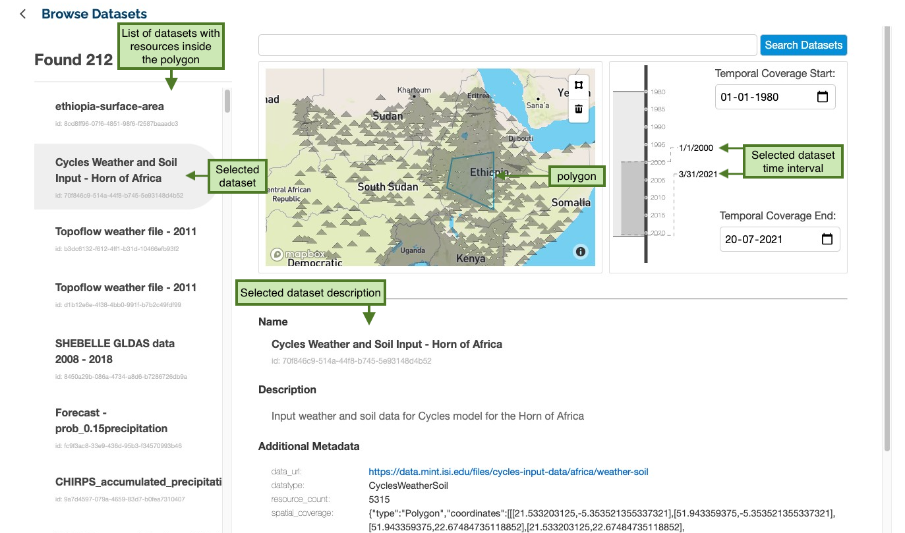

## Exploring data

To explore data, you must go to the **Browse Datasets** section and click on _Browse datasets_.

This page allows you to search datasets by name or description, for time interval or by drawing a polygon on the map.

All matching datasets will be shown on the left panel. Clicking on one will change the contents of the page to reflect
the data resources on the map, the time interval, and other relevant information.

