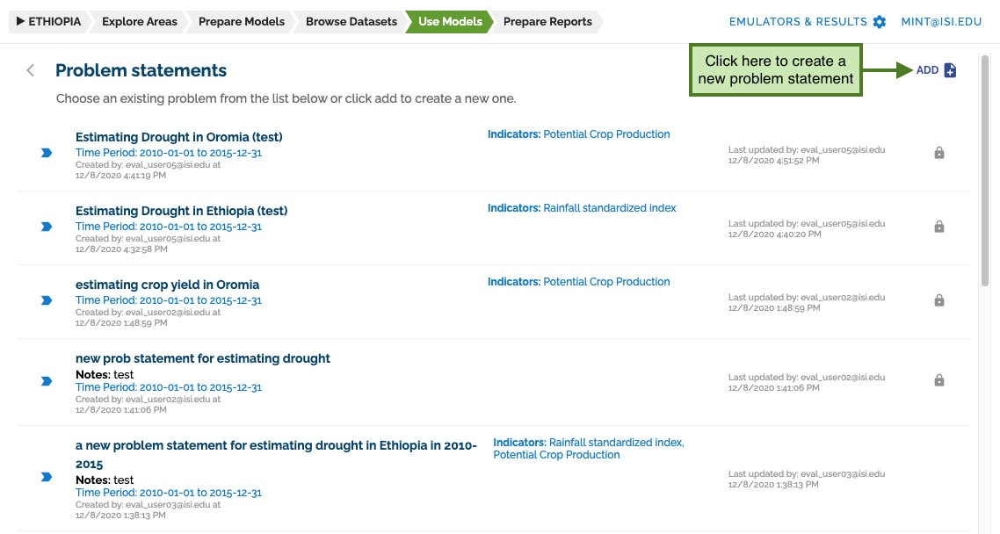
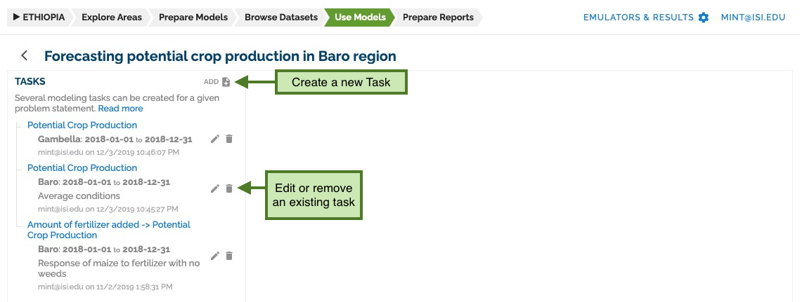
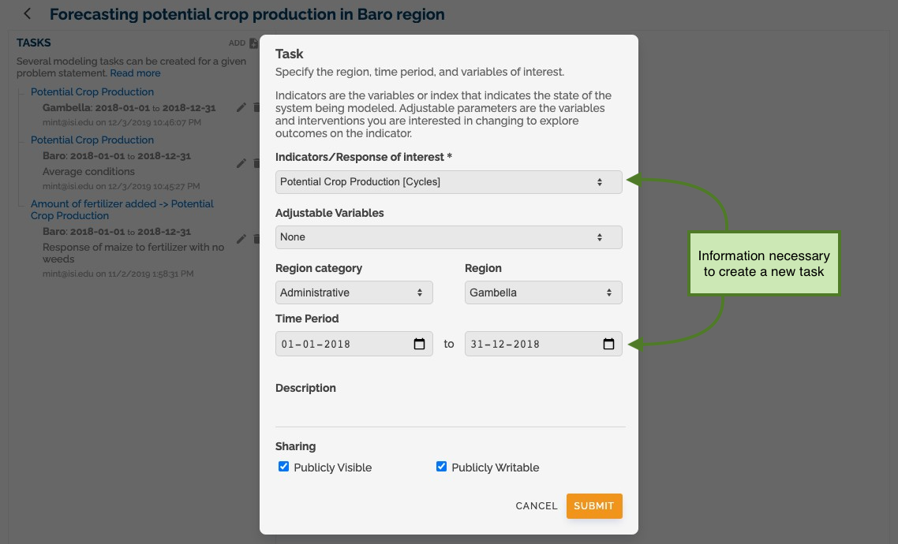
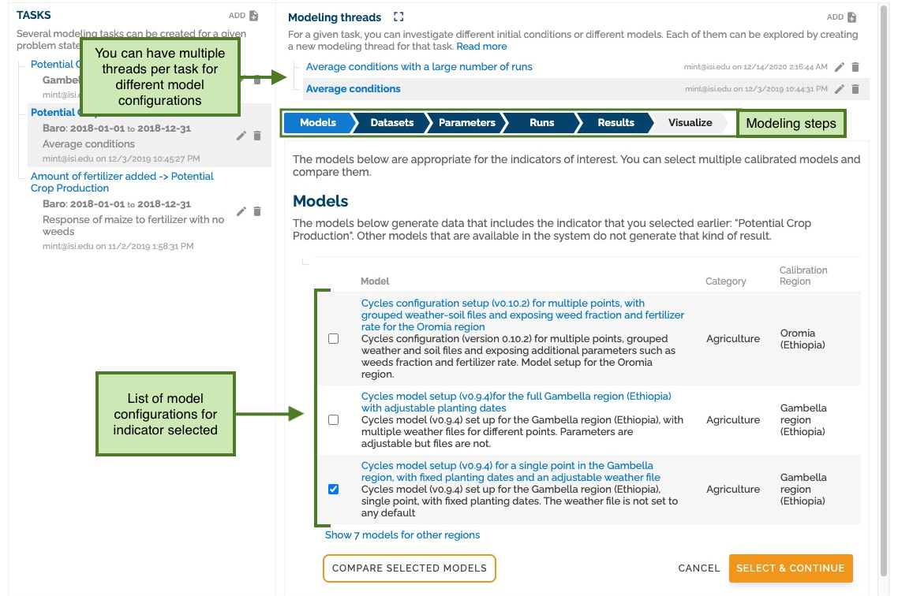
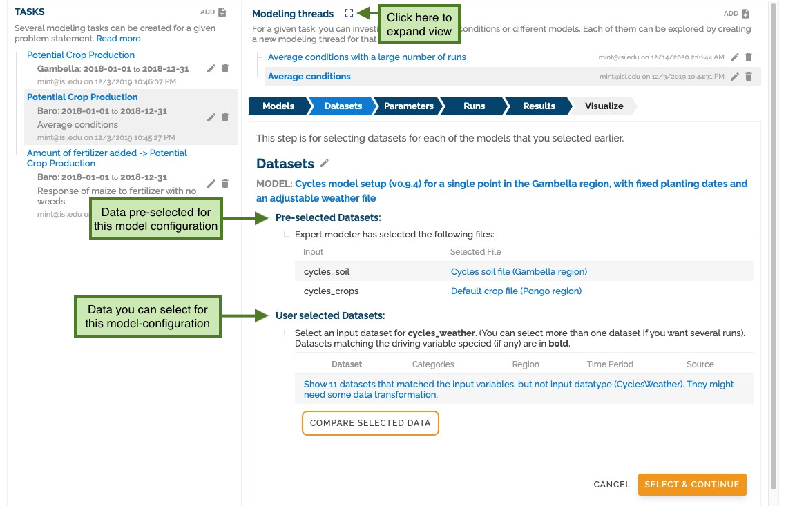
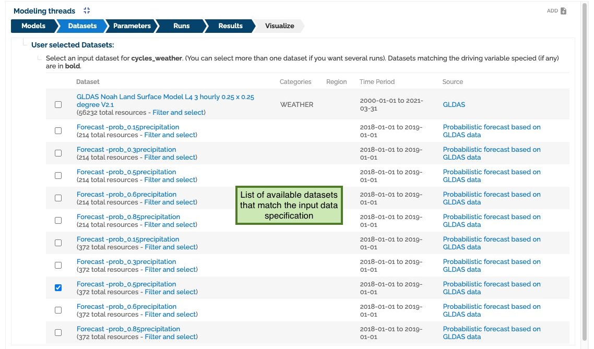
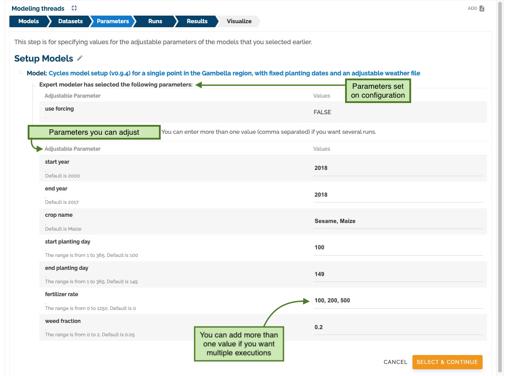
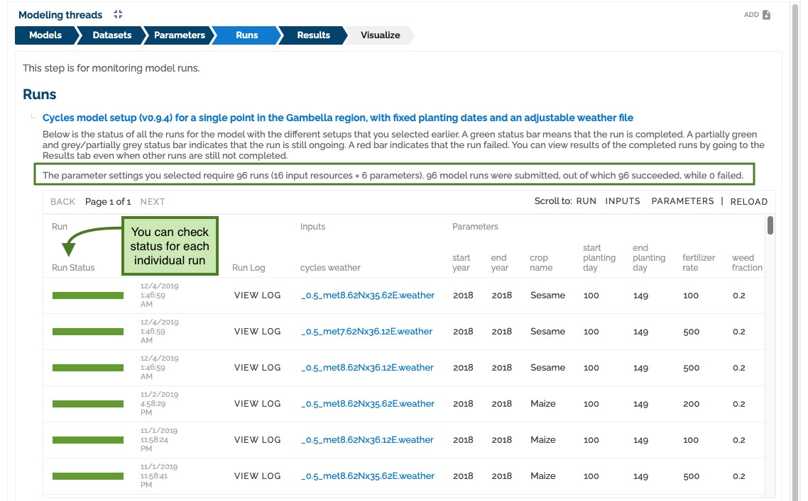
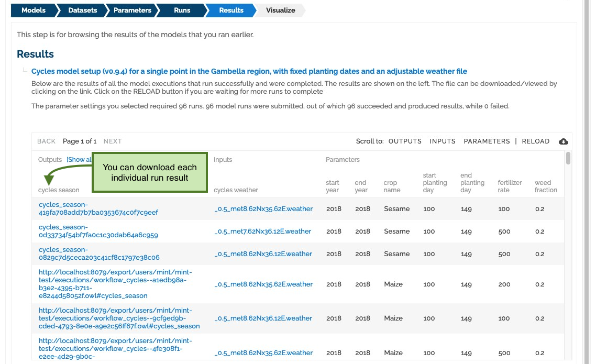
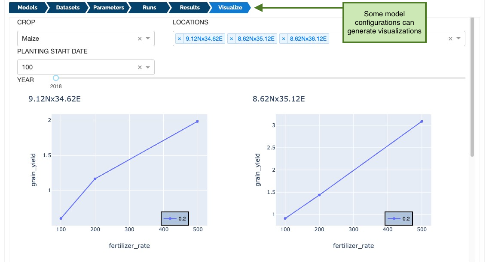

## Modeling

To use the models, you must go to the **User Models** section and select a problem statement or create a new one.

Each problem statement can have multiple tasks. You can edit or remove existing ones.

Creating a task requires you to specify a response of interest and a time interval.

Once a task is created, the system will create a default thread.
Threads are a way to group similar model executions on the same task.

Each task consists of a series of steps that must be followed to run the models correctly.
The first step is to select a model configuration setup you want to run from the list of models that matches your task specification.

Once a model configuration setup is selected, all pre-selected datasets will be added and the user will be asked to select them.
all datasets that were not specified in that setup.

You can click on the expand view button to go through the modeling steps.

If there is no data that matches all the variables specified in the input specification, the system will recommend datasets with a partial match.

Once all datasets have been selected, we need to set the parameters for this run. Using multiple parameters will generate multiple runs.

Once all parameters are set, we send the runs.

The system will show you a preview of each run and update you on the run status.

When all runs are done, the tab _Results_ will activate. Here you can see and download all the files generated during your model execution.

Some models can even generate a visualization, but this feature is not common at this moment.

