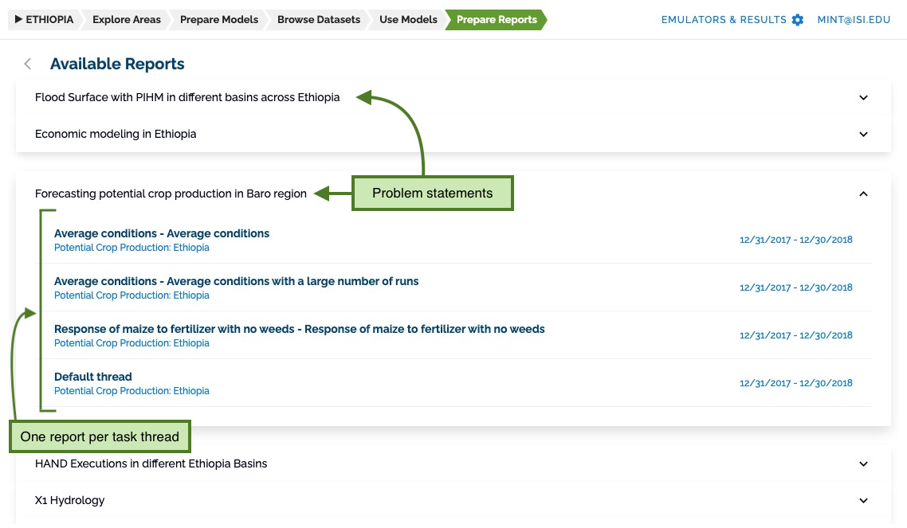
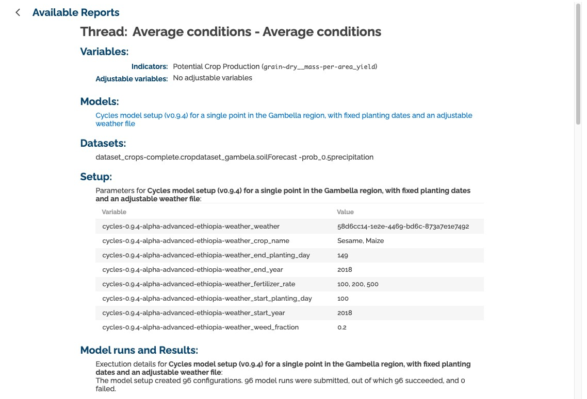

## Reporting

The MINT UI can generate simple reports for model runs.
For this, go to the **Prepare reports** section.
Here you will see all the threads grouped by problem statement.

Clicking on a thread name will show you a page with a resume of that thread's execution.

